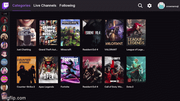

# Stitch (for Roku)

Stitch is A Twitch app for Roku.

## Discord

Because people have been asking for it, here is a discord server you can join for discussion and announcements

## Support

Best way to support Stitch is interaction with this project. Contributions are welcome.

## How to Install

### With Access Code

Stitch *uncertified* : LL5GKQ (<https://my.roku.com/account/add?channel=LL5GKQ>)

## URLs used by app (may need to be allowed in pihole, etc)

* <https://*.hls.ttvnw.net>               # Twitch Stream Server
* <https://usher.ttvnw.net>               # Twitch Stream Server
* <https://gql.twitch.tv>                 # Twitch Stream Access
* <https://id.twitch.tv>                  # Twitch Login
* <https://cdnjs.cloudflare.com>          # BootStrap for Web Auth
* <https://vod-secure.twitch.tv>          # Missing VOD Image
* <https://static-cdn.jtvnw.net>          # Twitch Emotes
* <https://cdn.betterttv.net>             # BetterTTV Emotes
* <https://api.twitch.tv>                 # Twitch API
* <https://badges.twitch.tv>              # Badges for Chat
* <https://api.betterttv.net>             # BetterTTV Emotes
* <irc.chat.twitch.ttv:6667>              # Twitch Chat

## FAQ

Please see our FAQ [here](./FAQ.md)
